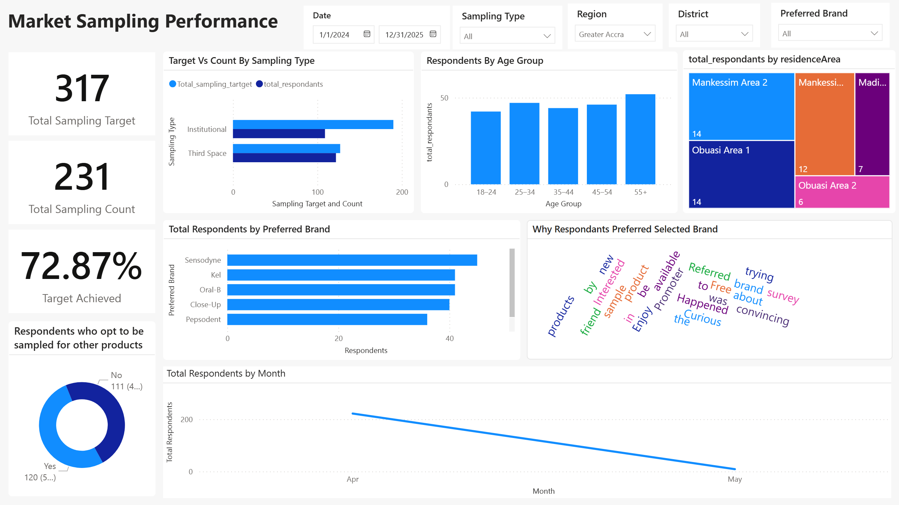

# Market Sampling Project

A comprehensive data management system for market sampling campaigns, designed to track toothpaste brand promotions across various locations and sampling types in Ghana.

##  Visualizations

### Database Entity-Relationship Model


### Dashboard


The ER diagram illustrates the complete database schema showing relationships between sampling events, respondents, areas, promoters, and lookup tables.

##  Project Overview

This project provides a complete solution for managing and analyzing market sampling campaigns. It includes a PostgreSQL database schema for storing sampling data and a Python-based data generation tool for creating realistic dummy data for testing and development purposes.

## Features

- **Multi-dimensional Database Schema**: Well-structured relational database design with fact and dimension tables
- **Geographic Coverage**: Supports sampling across multiple regions and districts in Ghana
- **Flexible Sampling Types**: 
  - Open Market sampling
  - Traffic sampling
  - Trade sampling
  - Third Space sampling
  - Institutional sampling (Churches, Mosques)
- **Respondent Tracking**: Comprehensive respondent information including demographics, preferences, and opt-in status
- **Dummy Data Generation**: Automated generation of realistic test data using Python and Faker library

## Project Structure

```
market-sampling-project/
├── src/                    # Source code
│   └── generate_dummy_data.py    # Main data generation script
├── notebooks/              # Jupyter notebooks
│   └── market_sampling_dummy_data_generation.ipynb
├── database/              # Database schemas and scripts
│   └── Market_Sampling_ER_Model_postgresql.sql
├── data/                  # Generated data files (gitignored)
│   └── market_sampling_dummy_data.xlsx
├── docs/                  # Documentation and reports
│   ├── Market_Sampling_ER_Model.pdf
│   └── Market Sampling Performance Dashboard.pbix
├── images/                # Diagrams and visualizations
│   └── Market Sampling ER Model.png
├── .gitignore            # Git ignore file
├── requirements.txt      # Python dependencies
└── README.md            # This file
```

## Database Schema

The database consists of the following tables:

### Core Tables

- **SamplingTable**: Main fact table storing sampling event details
- **RespondentTable**: Individual respondent information and responses
- **Area**: Geographic location data (regions, districts, areas)
- **PromoterTable**: Promoter information and contact details
- **SamplingTypeTable**: Types of sampling methods used
- **InstitutionTypeTable**: Types of institutions for institutional sampling
- **Date**: Date dimension table for temporal analysis

### Key Relationships

- Each sampling event is linked to a specific area, promoter, and sampling type
- Respondents are associated with sampling events
- Support for institutional sampling with institution type tracking
- Date tracking for both sampling events and respondent submissions

## Getting Started

### Prerequisites

- Python 3.7+
- PostgreSQL 12+ (for database deployment)
- Jupyter Notebook or JupyterLab

### Required Python Packages

```bash
pip install numpy pandas faker openpyxl
```

### Installation

1. Clone the repository:
```bash
git clone https://github.com/eunice-alswell/market-sampling-project.git
cd market-sampling-project
```

2. Install dependencies:
```bash
pip install -r requirements.txt
```

3. Set up the PostgreSQL database:
```bash
psql -U your_username -d your_database -f database/Market_Sampling_ER_Model_postgresql.sql
```

## Usage

### Method 1: Using Python Script (Recommended)

Run the Python script directly:
```bash
python src/generate_dummy_data.py
```

The script will:
- Generate realistic dummy data for all tables
- Save the data to `data/market_sampling_dummy_data.xlsx`
- Display statistics about generated records

### Method 2: Using Jupyter Notebook

1. Open the Jupyter notebook:
```bash
jupyter notebook notebooks/market_sampling_dummy_data_generation.ipynb
```

2. Run all cells to generate dummy data

3. The script will create an Excel file (`data/market_sampling_dummy_data.xlsx`) with the following sheets:
   - **Area**: Geographic location data
   - **Promoter**: Promoter information
   - **SamplingFact**: Sampling event records
   - **Respondents**: Individual respondent data
   - **SamplingType**: Sampling type lookup table

### Script Features

The `generate_dummy_data.py` script includes:
- **Modular functions**: Each data generation step is encapsulated in a function
- **Configurable parameters**: Easy to modify number of records, ID ranges, etc.
- **Reproducible results**: Uses seeded random generation (seed=42)
- **Type hints**: Clear function signatures for better code documentation
- **Comprehensive docstrings**: Detailed documentation for all functions

### Data Configuration

The dummy data generation includes:

- **Regions**: Greater Accra, Ashanti, Central
- **Districts**: Various districts within each region
- **Age Ranges**: 18–24, 25–34, 35–44, 45–54, 55+
- **Toothpaste Brands**: Pepsodent, Kel, Colgate, Close-Up, Oral-B, Sensodyne

## Data Model

### Sampling Event Attributes

- Sampling ID (unique identifier)
- Date of sampling
- Geographic location
- Sampling type and institution type (if applicable)
- Assigned promoter
- Target vs. actual count
- Passenger count (for traffic sampling)

### Respondent Attributes

- Respondent ID (unique identifier)
- Full name and contact information
- Age range
- Residence area
- Preferred toothpaste brand
- Reason for participation
- Opt-in status for other products
- Date of submission

## 🔧 Customization

You can customize the data generation by modifying the following variables in the notebook:

- `sampling_Types`: Add or modify sampling type categories
- `institution_types`: Add religious or institutional types
- `regions_districts`: Add new regions and districts
- `age_ranges`: Modify age range categories
- `toothpaste_brands`: Add or remove brand names
- `reasons`: Customize participation reasons

## Analytics and Reporting

### Power BI Dashboard
The project includes a Power BI dashboard (`docs/Market Sampling Performance Dashboard.pbix`) for visualizing:
- Sampling performance by region and district
- Promoter effectiveness analysis
- Brand preference trends
- Respondent demographics and participation patterns
- Time-series analysis of sampling campaigns

To use the dashboard, import the generated Excel data into Power BI and refresh the data source.

## Use Cases

- **Market Research**: Track and analyze brand preferences across different regions
- **Campaign Management**: Monitor promoter performance and sampling effectiveness
- **Business Intelligence**: Generate insights on geographic and demographic trends
- **Data Analytics**: Practice data analysis and visualization with realistic datasets

## Technologies Used

- **Database**: PostgreSQL
- **Programming Language**: Python 3
- **Libraries**: 
  - Pandas (data manipulation)
  - NumPy (numerical operations)
  - Faker (synthetic data generation)
- **Tools**: Jupyter Notebook

## Documentation

Additional documentation is available in the `docs/` folder:
- **ER Model PDF**: Detailed entity-relationship diagram (`Market_Sampling_ER_Model.pdf`)
- **Power BI Dashboard**: Interactive analytics dashboard (`Market Sampling Performance Dashboard.pbix`)

## Database Tables Schema

### SamplingTable
- `samplingID` (PRIMARY KEY)
- `samplingDate`
- `areaID` (FOREIGN KEY)
- `SamplingTypeID` (FOREIGN KEY)
- `InstitutionTypeID` (FOREIGN KEY)
- `PromoterID` (FOREIGN KEY)
- `SamplingTarget`
- `SamplingCount`
- `PassengersPerCar`

### RespondentTable
- `respondentID` (PRIMARY KEY)
- `samplingID` (FOREIGN KEY)
- `fullName`
- `ageRange`
- `contact`
- `residenceArea`
- `preferredBrand`
- `reason`
- `optInOtherProducts`
- `Dateofsubmission`

## Contributing

Contributions are welcome! Please feel free to submit a Pull Request.

## License

This project is open source and available under the [MIT License](LICENSE).

## 👤 Author

**Eunice Alswell**

- GitHub: [@eunice-alswell](https://github.com/eunice-alswell)

## Acknowledgments

- Faker library for realistic dummy data generation
- PostgreSQL community for excellent documentation
- All contributors and users of this project

## Contact

For questions or feedback, please open an issue on GitHub or contact the repository owner.

---

**Note**: This project generates dummy data for demonstration and testing purposes. For production use, ensure proper data validation and comply with data protection regulations.
